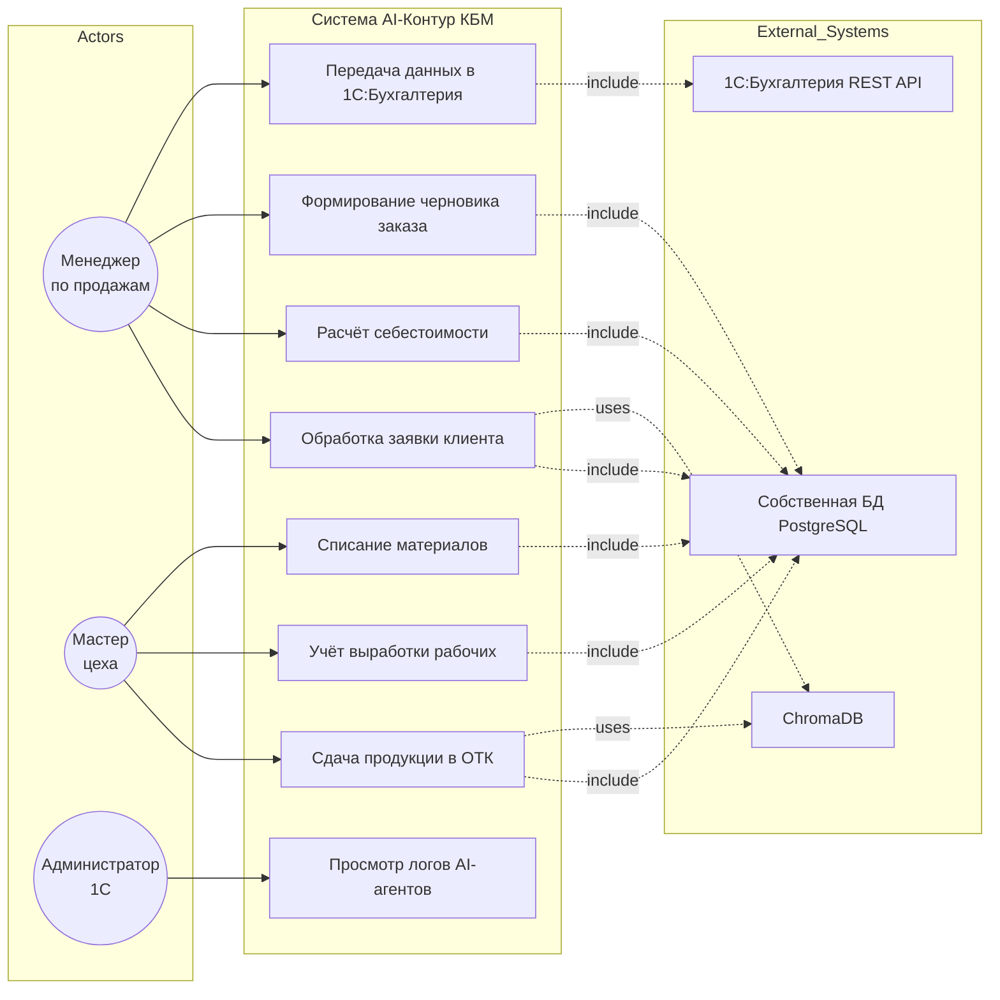
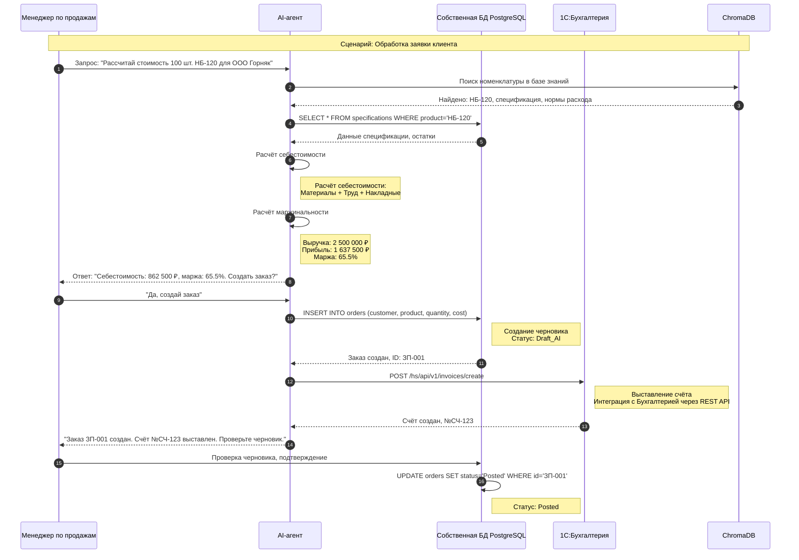
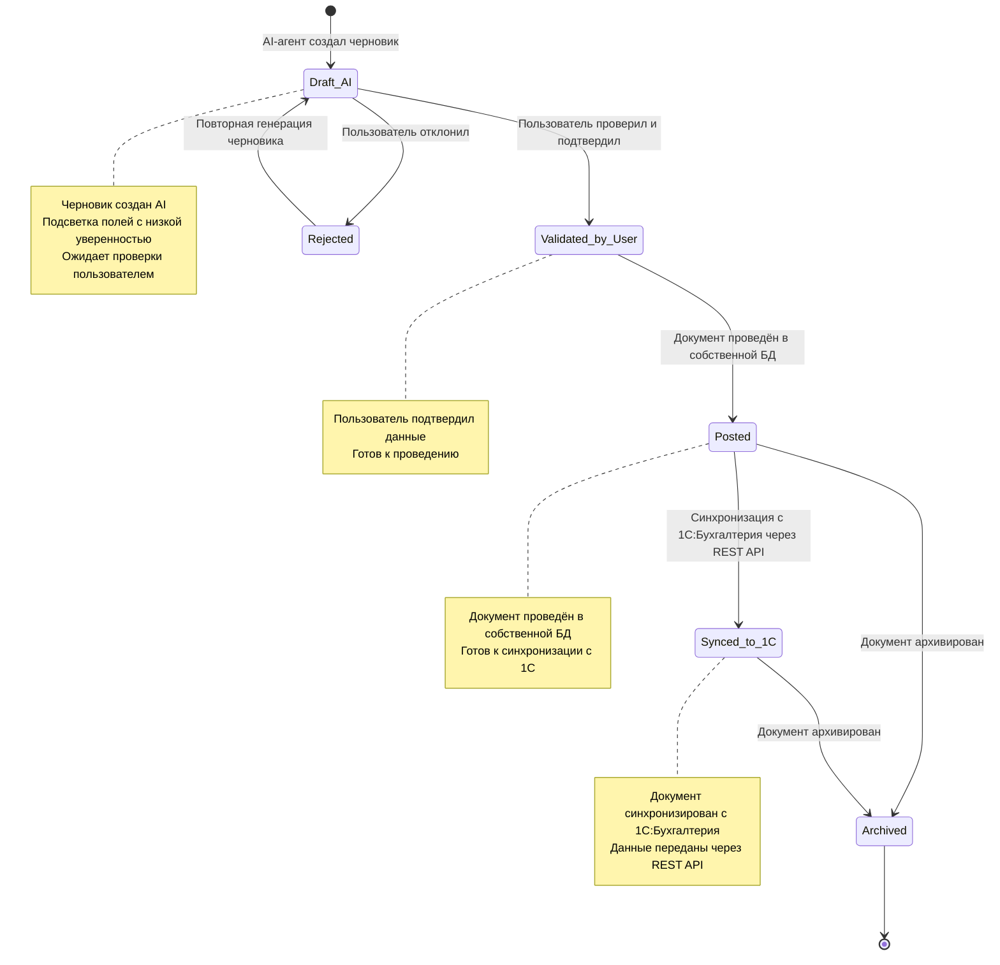

# 📄 ДОКУМЕНТ 2: СИСТЕМАТИЗАЦИЯ ДАННЫХ И ДЕТАЛИЗАЦИЯ ПРОЦЕССОВ

## Проект «AI-Контур КБМ»: Внедрение AI-агентов для ООО «КубаньБурМаш»

### Часть 1: Ролевая модель, бизнес-процессы MVP и архитектурные решения

**Дата:** 20 июля 2026 г.  
**Аналитик:** ООО "Автостар Плюс"  
**Статус:** Готов к передаче заказчику

---

## 1. Описание предметной области

**Предметная область:** Производственное предприятие ООО «КубаньБурМаш» (КБМ) — производство буровых наконечников.

**Текущее состояние:**

- Штат: 200+ сотрудников
- **Собственная БД приложения (PostgreSQL)** — основной источник данных для всех сотрудников
- **1С:Бухгалтерия** — используется только бухгалтером для финансовых операций (счета, выписки, акты)
- Расчёты с контрагентами: исключительно безналичные переводы по расчётным счетам
- Проблемы: саботаж учёта производственным персоналом, дублирование в Excel и на бумаге, неактуальные данные, ручной расчёт себестоимости

**Цель автоматизации:** Внедрить слой AI-агентов поверх собственной БД приложения с интеграцией в 1С:Бухгалтерия для автоматизации рутинных операций 14 ролей сотрудников.

**Ожидаемый результат:**

- Сотрудники взаимодействуют с системой через естественный язык (веб-чат)
- AI-агенты создают черновики документов в собственной БД, которые проводятся только после подтверждения пользователем
- Сокращение времени обработки операций с 15 минут до 2 минут
- Полная прозрачность и аудит всех действий AI
- Автоматическая синхронизация бухгалтерских документов с 1С:Бухгалтерия через REST API

---

## 2. Ролевая модель (14 AI-агентов)

| №   | Роль                           | Ключевые действия в системе                                                                             | Главная потребность                                                    |
| --- | ------------------------------ | ------------------------------------------------------------------------------------------------------- | ---------------------------------------------------------------------- |
| 1   | **Менеджер по продажам** (MVP) | Обработка заявок клиентов, расчёт себестоимости, расчёт маржинальности, формирование черновиков заказов | Быстро получать расчёты и формировать документы без ручного ввода      |
| 2   | **Мастер цеха** (MVP)          | Фиксация выработки, сдача продукции в ОТК, списание материалов, учёт трудозатрат рабочих                | Минимизировать время на заполнение документов, автоматизировать рутину |
| 3   | Инженер ПДО                    | Формирование заказов на производство, расчёт потребности в материалах, контроль загрузки цехов          | Автоматизировать рутинные операции, получить оперативную аналитику     |
| 4   | Снабженец                      | Анализ потребностей в материалах, формирование заказов поставщикам, контроль сроков поставки            | Получать готовые списки закупок по голосовым/текстовым запросам        |
| 5   | Кладовщик                      | Приёмка материалов, оприходование, выдача в производство, инвентаризация                                | Ускорить приёмку, избежать «минуса на складе»                          |
| 6   | Контролёр ОТК                  | Создание актов контроля качества, учёт брака, приёмка ТМЦ                                               | Автоматическое создание актов при приёмке продукции                    |
| 7   | Экономист                      | Расчёт себестоимости заказов, анализ отклонений План-Факт, формирование отчётов                         | Получать аналитику по голосовым запросам                               |
| 8   | Бухгалтер                      | Начисление зарплаты по нарядам, сверка с мастерами, синхронизация с 1С:Бухгалтерия                      | Автоматизировать начисления, снизить ручной ввод                       |
| 9   | Главный инженер                | Контроль загрузки оборудования, анализ простоев, планирование ремонтов                                  | Оперативная аналитика по загрузке и простоям                           |
| 10  | Технолог                       | Ведение спецификаций, норм расхода, контроль техпроцессов                                               | Удобное редактирование спецификаций, ответы на вопросы мастеров        |
| 11  | Нормировщик                    | Учёт выработки, настройка расценок, контроль трудозатрат                                                | Автоматизировать учёт и расчёты                                        |
| 12  | Руководитель                   | KPI в реальном времени: маржинальность, НЗП, брак, загрузка цехов                                       | Оперативная аналитика без ручного сбора данных                         |
| 13  | Администратор 1С               | Управление правами, мониторинг логов AI-агентов, контроль безопасности                                  | Сохранить контроль, получить аудит действий AI                         |
| 14  | Кадровик                       | Оформление приёма на работу, ведение штатного расписания                                                | Автоматизировать кадровые операции                                     |

---

## 3. Карта целей и конфликтов интересов

| Роль                     | Цель в системе                                                | Конфликт интересов                                                                 |
| ------------------------ | ------------------------------------------------------------- | ---------------------------------------------------------------------------------- |
| **Менеджер по продажам** | Быстро получать расчёты себестоимости и формировать документы | Хочет минимизировать время на документы, но может пропустить валидацию данных      |
| **Мастер цеха**          | Минимизировать время на заполнение документов                 | Хочет простоты, но может не заполнять обязательные поля (например, «Операции»)     |
| **Экономист**            | Получать точную аналитику по маржинальности и отклонениям     | Требует точности данных, но зависит от качества ввода мастерами                    |
| **Администратор 1С**     | Сохранить контроль над системой, получить аудит действий AI   | Боится потери контроля из-за AI-агентов, может сопротивляться внедрению            |
| **Руководитель**         | Получить прозрачный контроль над бизнесом в реальном времени  | Требует строгого учёта, что может восприниматься персоналом как тотальный контроль |

**Разрешение конфликтов:**

- **Мастер vs Экономист:** AI-агент подсвечивает незаполненные обязательные поля, не даёт провести документ без валидации
- **Администратор vs Внедрение:** Показываем преимущества: RLS, аудит, логирование, автоматизация рутины. Вовлекаем администратора в настройку и контроль
- **Руководитель vs Персонал:** AI-агенты снижают порог входа (естественный язык вместо сложного интерфейса)

---

## 4. Точки взаимодействия (Touchpoints)

### Цифровые:

- **Веб-чат** (адаптивный интерфейс) — основной канал взаимодействия с AI-агентами
- **Telegram-бот** (опционально, этап 4) — для мобильных сотрудников
- **Голосовой интерфейс** (Whisper + TTS, этап 4) — для мастеров в цеху

### Интеграционные:

- **Собственная БД приложения (PostgreSQL)** — хранение всех данных: документы, справочники, история операций
- **1С:Бухгалтерия** — синхронизация только бухгалтерских объектов через REST API (счета на оплату, банковские выписки, акты выполненных работ)
- **ChromaDB** — векторная база знаний (регламенты, спецификации, справочники)
- **OpenRouter API / Qwen API** — LLM для обработки естественного языка

### Физические:

- **Существующая ВМ Заказчика** — развёртывание Docker-контейнеров (Ubuntu 22.04, 6 vCPU, 11 GB RAM)

---

## 5. Бизнес-процесс AS IS: Менеджер по продажам

**Процесс:** Обработка заявки клиента и расчёт себестоимости  
**Актор:** Менеджер по продажам  
**Триггер:** Поступление заявки от клиента (звонок, email, мессенджер)

### Шаги процесса AS IS:

1. Менеджер получает заявку от клиента (устно или письменно)
2. Менеджер открывает Excel-файл с номенклатурой, ищет буровой наконечник
3. Менеджер вручную открывает отчёт по остаткам для проверки наличия
4. Менеджер открывает спецификации для расчёта потребности в материалах
5. Менеджер вручную рассчитывает себестоимость в Excel (материалы + труд + накладные)
6. Менеджер заполняет шаблон заказа вручную
7. Менеджер отправляет счёт клиенту по email
8. Менеджер вручную передаёт данные бухгалтеру для выставления счёта в 1С:Бухгалтерия

**Проблемы AS IS:**

- Время обработки заявки: 30–40 минут
- Риск ошибок при ручном расчёте себестоимости
- Дублирование данных между Excel и 1С:Бухгалтерия
- Нет оперативной аналитики по маржинальности

---

## 6. Бизнес-процесс TO BE: Менеджер по продажам (MVP)

**Процесс:** Обработка заявки клиента и расчёт себестоимости (с AI-агентом)  
**Актор:** Менеджер по продажам, AI-агент  
**Триггер:** Менеджер пишет в веб-чат: «Рассчитай стоимость 100 шт. НБ-120 для ООО "Горняк"»

### Шаги процесса TO BE:

1. **[Пользователь]** Менеджер пишет запрос в веб-чат
2. **[Система]** AI-агент извлекает сущности: клиент, товар, количество, срок
3. **[Система]** AI-агент запрашивает себестоимость из собственной БД приложения (справочник спецификаций)
4. **[Система]** AI-агент рассчитывает маржинальность и формирует ответ
5. **[Система]** AI-агент создаёт черновик заказа в собственной БД приложения (статус: `Draft_AI`)
6. **[Пользователь]** Менеджер проверяет черновик, при необходимости редактирует
7. **[Пользователь]** Менеджер нажимает «Подтвердить и провести»
8. **[Система]** Документ проводится в собственной БД (статус: `Posted`)
9. **[Система]** AI-агент автоматически создаёт счёт в 1С:Бухгалтерия через REST API
10. **[Система]** AI-агент отправляет менеджеру подтверждение с номером счёта

**Что изменилось:**

- ⏱ Время обработки: 30–40 мин → 2–3 мин
- 🧮 Ручной расчёт → автоматический расчёт AI
- 📄 Ручной ввод → автоматическое создание черновиков
- 🔄 Ручное дублирование → автоматическая интеграция с 1С:Бухгалтерия

---

## 7. Альтернативные и ошибочные сценарии: Менеджер по продажам

### Альтернативные потоки:

**А1. Клиент запрашивает нестандартную номенклатуру (к шагу 2)**

- 2а. AI-агент не находит точное совпадение в справочнике номенклатуры
- AI-агент предлагает ближайшие варианты: «Вы имели в виду "НБ-120" или "НБ-150"?»
- Менеджер выбирает правильный вариант
- Возврат на шаг 3

**А2. Менеджер хочет изменить расчёт после получения (к шагу 5)**

- 5а. Менеджер пишет: «Пересчитай с учётом скидки 10%»
- AI-агент пересчитывает маржинальность с учётом скидки
- Возврат на шаг 5

### Ошибочные потоки:

**Е1. AI-агент не может извлечь сущности (к шагу 2)**

- 2а. Уверенность извлечения < 80% (confidence score)
- AI-агент подсвечивает неопределённые поля жёлтым цветом
- AI-агент запрашивает уточнение: «Уточните, пожалуйста, количество и срок поставки»
- Менеджер уточняет данные
- Возврат на шаг 2

**Е2. База данных приложения недоступна (к шагу 3)**

- 3а. PostgreSQL возвращает ошибку (техработы, авария)
- AI-агент показывает: «Система временно недоступна. Попробуйте позже или обратитесь к администратору»
- Создаётся тикет в системе мониторинга
- Результат: цель НЕ достигнута — расчёт не выполнен

**Е3. Ошибка при создании черновика (к шагу 5)**

- 5а. База данных возвращает ошибку валидации (например, не заполнено обязательное поле)
- AI-агент показывает: «Не удалось создать черновик: [причина ошибки]»
- AI-агент предлагает исправить данные
- Результат: цель НЕ достигнута — черновик не создан

**Е4. Интеграция с 1С:Бухгалтерия недоступна (к шагу 9)**

- 9а. REST API 1С:Бухгалтерия не отвечает
- AI-агент показывает: «Заказ создан, но счёт в 1С:Бухгалтерия не выставлен. Администратор уведомлён»
- Менеджер может вручную передать данные бухгалтеру позже
- Результат: цель частично достигнута — черновик создан, но счёт не выставлен

---

## 8. Бизнес-процесс AS IS: Мастер цеха

**Процесс:** Сдача продукции в ОТК и учёт выработки  
**Актор:** Мастер цеха  
**Триггер:** Завершение партии изделий (например, 50 шт. НБ-150)

### Шаги процесса AS IS:

1. Мастер завершает партию изделий
2. Мастер открывает Excel-файл, ищет форму «Отчёт производства за смену»
3. Мастер заполняет 7 колонок вручную (изделие, количество, исполнители, материалы, операции)
4. Мастер передаёт данные в ОТК (бумажный журнал или Excel)
5. Контролёр ОТК вручную переносит данные в свою таблицу (акт контроля качества)
6. Мастер забывает заполнить колонку «Операции» → рабочие не получают зарплату вовремя

**Проблемы AS IS:**

- Время заполнения: 10–15 минут на партию
- Риск ошибок при ручном вводе
- Частые конфликты из-за незаполненных «Операций»
- Дублирование данных между мастером и ОТК

---

## 9. Бизнес-процесс TO BE: Мастер цеха (MVP)

**Процесс:** Сдача продукции в ОТК и учёт выработки (с AI-агентом)  
**Актор:** Мастер цеха, AI-агент  
**Триггер:** Мастер пишет в веб-чат: «Сдал 50 шт. НБ-150 в ОТК. Работали Иванов и Петров. Ушло 200 кг стали 40Х»

### Шаги процесса TO BE:

1. **[Пользователь]** Мастер пишет запрос в веб-чат
2. **[Система]** AI-агент извлекает сущности: изделие, количество, исполнители, материалы
3. **[Система]** AI-агент проверяет данные по справочникам собственной БД (номенклатура, сотрудники, материалы)
4. **[Система]** AI-агент создаёт черновик «Отчёта производства за смену» в собственной БД (статус: `Draft_AI`)
5. **[Система]** AI-агент автоматически создаёт черновик «Акта контроля качества» для ОТК
6. **[Пользователь]** Мастер проверяет черновик, при необходимости редактирует
7. **[Пользователь]** Мастер нажимает «Подтвердить и провести»
8. **[Система]** Документ проводится в собственной БД (статус: `Posted`)
9. **[Система]** AI-агент автоматически передаёт данные в ОТК (статус: `Pending_QC`)
10. **[Система]** AI-агент отправляет мастеру подтверждение с номером документа

**Что изменилось:**

- ⏱ Время заполнения: 10–15 мин → 1–2 мин
- 🧮 Ручной ввод → голосовой/текстовый ввод
- 📄 Заполнение 7 колонок → автоматическое создание черновика
- 🔄 Ручная передача в ОТК → автоматическая синхронизация

---

## 10. Альтернативные и ошибочные сценарии: Мастер цеха

### Альтернативные потоки:

**А1. Мастер указывает неполные данные (к шагу 2)**

- 2а. AI-агент не может определить всех исполнителей или материалы
- AI-агент подсвечивает неопределённые поля жёлтым цветом
- AI-агент запрашивает уточнение: «Уточните, пожалуйста, кто ещё работал и сколько материалов ушло»
- Мастер уточняет данные
- Возврат на шаг 2

**А2. Мастер хочет добавить ещё одну партию (к шагу 6)**

- 6а. Мастер пишет: «Добавь ещё 30 шт. НБ-120»
- AI-агент обновляет черновик, добавляя вторую позицию
- Возврат на шаг 6

### Ошибочные потоки:

**Е1. AI-агент не может распознать номенклатуру (к шагу 2)**

- 2а. Уверенность извлечения < 80%
- AI-агент подсвечивает поле «Изделие» жёлтым цветом
- AI-агент предлагает варианты: «Вы имели в виду "НБ-150" или "КБ-50"?»
- Мастер выбирает правильный вариант
- Возврат на шаг 2

**Е2. Материалов недостаточно на складе (к шагу 3)**

- 3а. AI-агент проверяет остатки и обнаруживает «минус на складе»
- AI-агент показывает: «Внимание: на складе недостаточно стали 40Х. Остаток: 150 кг, требуется: 200 кг»
- AI-агент предлагает: «Продолжить с текущими данными или сначала оформить поступление?»
- Мастер выбирает действие
- Результат: цель частично достигнута — черновик создан, но есть предупреждение

**Е3. База данных приложения недоступна (к шагу 4)**

- 4а. PostgreSQL возвращает ошибку
- AI-агент показывает: «Система временно недоступна. Черновик сохранён локально и будет отправлен при восстановлении связи»
- Черновик сохраняется в локальном кэше
- Результат: цель отложена — документ будет создан позже

**Е4. Ошибка при проведении документа (к шагу 8)**

- 8а. База данных возвращает ошибку валидации (например, не заполнено обязательное поле «Операции»)
- AI-агент показывает: «Не удалось провести документ: [причина ошибки]»
- AI-агент предлагает исправить данные
- Результат: цель НЕ достигнута — документ не проведён

---

## 11. Статусы сущностей и правила переходов

### 11.1 Статусы документа в приложении

| Статус              | Описание                                                   | Разрешённые переходы                |
| ------------------- | ---------------------------------------------------------- | ----------------------------------- |
| `Draft_AI`          | Черновик создан AI-агентом, ожидает проверки пользователем | → `Validated_by_User`, → `Rejected` |
| `Validated_by_User` | Пользователь проверил и подтвердил черновик                | → `Posted`                          |
| `Posted`            | Документ проведён в собственной БД                         | → `Synced_to_1C`, → `Archived`      |
| `Synced_to_1C`      | Документ синхронизирован с 1С:Бухгалтерия                  | → `Archived`                        |
| `Rejected`          | Пользователь отклонил черновик                             | → `Draft_AI` (повторная генерация)  |
| `Archived`          | Документ архивирован                                       | —                                   |

**Правило:** Запрещён прямой переход `Draft_AI` → `Posted`. Требуется валидация пользователем.

### 11.2 Статусы AI-сессии

| Статус               | Описание                                       | Триггер перехода                          |
| -------------------- | ---------------------------------------------- | ----------------------------------------- |
| `Active`             | Сессия активна, AI обрабатывает запросы        | Пользователь начал диалог                 |
| `Escalated_to_Human` | AI не смог обработать запрос, передан человеку | 2 нераспознанных запроса подряд           |
| `Closed`             | Сессия завершена                               | Пользователь закрыл чат или истёк таймаут |

### 11.3 Статусы передачи данных в ОТК

| Статус        | Описание                                | Разрешённые переходы              |
| ------------- | --------------------------------------- | --------------------------------- |
| `Pending_QC`  | Данные переданы в ОТК, ожидают проверки | → `QC_Approved`, → `QC_Rejected`  |
| `QC_Approved` | ОТК принял продукцию                    | → `Archived`                      |
| `QC_Rejected` | ОТК выявил брак                         | → `Rework` (возврат на доработку) |
| `Rework`      | Продукция возвращена на доработку       | → `Pending_QC` (повторная сдача)  |

---

## 12. SLA (Service Level Agreement)

| Процесс                           | Метрика                                             | Значение    | Ответственный    |
| --------------------------------- | --------------------------------------------------- | ----------- | ---------------- |
| **Время ответа AI-агента**        | p95 времени отклика                                 | ≤ 5 секунд  | AI-архитектор    |
| **Точность извлечения сущностей** | Процент корректно извлечённых данных                | ≥ 95%       | AI-архитектор    |
| **Доступность системы**           | Uptime в рабочие часы (08:00–18:00)                 | 99.5%       | Администратор    |
| **SLA эскалации**                 | Время передачи запроса человеку при нераспознавании | ≤ 15 минут  | AI-архитектор    |
| **Время создания черновика**      | От запроса пользователя до создания черновика в БД  | ≤ 10 секунд | AI-архитектор    |
| **Интеграция с 1С:Бухгалтерия**   | Время передачи данных в 1С через REST API           | ≤ 30 секунд | Администратор 1С |
| **Обработка ошибок**              | Время уведомления пользователя об ошибке            | ≤ 5 секунд  | AI-архитектор    |

---

## 13. Диаграммы (Mermaid)

### 13.1 Use Case Diagram — MVP (Менеджер по продажам и Мастер цеха)

### 13.2 Sequence Diagram — Обработка заявки клиента (Менеджер по продажам)

### 13.3 State Machine Diagram — Жизненный цикл документа в приложении

---

## 14. Ключевые архитектурные решения

### 14.1 Обработка "галлюцинаций" AI

**Проблема:** LLM может выдумать данные (цены, остатки, сроки), которых нет в базе знаний.

**Решение:**

1. **Подсветка полей с низкой уверенностью:** Если confidence score < 80%, поле подсвечивается жёлтым цветом
2. **RAG с проверкой контекста:** AI-агент ищет данные только в векторной базе знаний (ChromaDB)
3. **Запрет на ответы "из головы":** Строгие системные промпты запрещают генерацию данных без подтверждения из базы
4. **Режим черновиков:** Все документы создаются как черновики (`Draft_AI`), проводятся только после подтверждения пользователем
5. **Двойное подтверждение:** Для критичных операций (суммы > 100 000 ₽) требуется дополнительное подтверждение

### 14.2 Архитектура: Собственная БД + Интеграция с 1С:Бухгалтерия

**Проблема:** Необходимо обеспечить работу всех 14 ролей сотрудников без использования 1С:УНФ как основной системы.

**Решение:**

- **Собственная БД приложения (PostgreSQL)** — основной источник данных для всех сотрудников
- **1С:Бухгалтерия** — используется только бухгалтером для финансовых операций
- **Интеграция через REST API** — автоматическая синхронизация бухгалтерских объектов (счета, выписки, акты)
- **Два независимых приложения** — приложение сотрудников и 1С:Бухгалтерия работают автономно, обмениваясь данными через API

### 14.3 Расчёты с контрагентами

**Ограничение:** Расчёты происходят исключительно безналичными переводами по расчётным счетам.

**Решение:**

- AI-агент формирует счета на оплату в собственной БД приложения
- После подтверждения пользователем — автоматическая синхронизация с 1С:Бухгалтерия через REST API
- Интеграция с клиент-банком для автоматической загрузки банковских выписок
- Автоматическая сверка оплат с выставленными счетами

---

## 15. Открытые вопросы (для уточнения на следующей встрече)

| №   | Вопрос                                                                                        | Ответственный    | Срок       |
| --- | --------------------------------------------------------------------------------------------- | ---------------- | ---------- |
| 1   | Какой LLM-провайдер использовать в продакшене: OpenRouter или прямой API Qwen?                | Абрамов А.В.     | 22.07.2026 |
| 2   | Нужна ли интеграция с Telegram в MVP или только веб-чат?                                      | Нагорный П.В.    | 22.07.2026 |
| 3   | Как обрабатывать ситуацию, когда AI-агент не может распознать запрос (эскалация на человека)? | Абрамов А.В.     | 22.07.2026 |
| 4   | Какой радиус допустимой погрешности при извлечении сущностей (количество, даты, суммы)?       | Абрамов А.В.     | 22.07.2026 |
| 5   | Нужна ли админ-панель для управления AI-агентами (просмотр логов, сброс диалогов)?            | Администратор 1С | 22.07.2026 |

---

## 16. Итоги Части 1

✅ **Ролевая модель:** Зафиксированы 14 ролей и их ключевые потребности  
✅ **Карта целей:** Выявлены 5 конфликтов интересов и предложены решения  
✅ **Точки взаимодействия:** Определены цифровые, интеграционные и физические touchpoints  
✅ **Бизнес-процессы MVP:** Детально описаны AS IS и TO BE для Менеджера по продажам и Мастера цеха  
✅ **Альтернативные и ошибочные сценарии:** Описаны для обоих процессов MVP  
✅ **Статусы сущностей:** Зафиксированы статусы документов, AI-сессий и передачи данных в ОТК  
✅ **SLA:** Определены измеримые метрики качества  
✅ **Диаграммы:** Построены Use Case, Sequence и State Machine в формате Mermaid  
✅ **Архитектурные решения:** Зафиксированы подходы к обработке галлюцинаций, архитектуре (собственная БД + интеграция с 1С:Бухгалтерия) и расчётам с контрагентами

---

**Статус документа:** Готов к передаче заказчику  
**Следующие шаги:**

1. Согласование Части 1 с заказчиком
2. Переход к Части 2: Реестр требований и Дополнительное соглашение №1

---

**Документ составил:** Абрамов Андрей Васильевич, AI-архитектор / системный аналитик  
**Дата:** 20 июля 2026 г.

---
