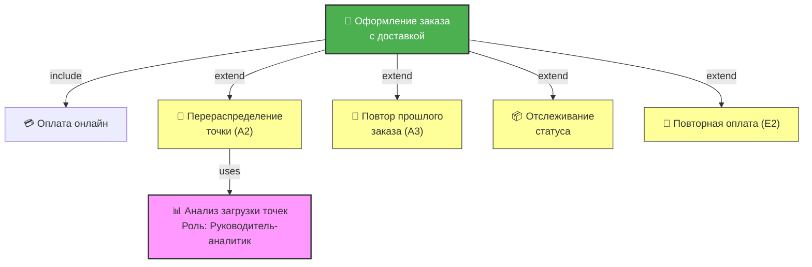

# Задание 2. Описание сценариев и взаимосвязей между ними

## Кейс: Химчистка «Чистый пиджак»

**Дата:** 26.07.2026
**Автор:** Системный аналитик

---

## Шаг 1. Основные пользовательские роли

| №   | Роль                                  | Ключевые действия в системе                                                                             | Главная потребность                                                               |
| --- | ------------------------------------- | ------------------------------------------------------------------------------------------------------- | --------------------------------------------------------------------------------- |
| 1   | **Клиент**                            | Выбирает услугу, оформляет заказ, оплачивает, отслеживает статус, повторяет прошлый заказ               | Получить услугу химчистки быстро, прозрачно и без звонков в точку                 |
| 2   | **Оператор химчистки**                | Принимает заказ, маркирует вещи, меняет статусы («Принят» → «В работе» → «Готов» → «Можно забирать»)    | Обрабатывать заказы без путаницы в бумажных квитанциях и без отвлечения на звонки |
| 3   | **Курьер**                            | Забирает вещи из точки, доставляет клиенту, фиксирует факт вручения                                     | Получать оптимальный маршрут и список заказов с адресами и контактами             |
| 4   | **[Допущение] Руководитель-аналитик** | Анализирует загрузку точек, настраивает правила перераспределения нагрузки, контролирует маржинальность | Выявлять узкие горлышки (особенно в субботу) и оптимизировать ресурсы сети        |

> **Примечание:** Роль №4 введена по допущению на основании проблем кейса (перегрузка в субботу, путаница в квитанциях, звонки о статусе). Эти проблемы не решаются на уровне оператора — требуется стратегический взгляд. В рамках MVP функционал роли ограничен базовыми метриками.

---

## Шаг 2. Выбранный ключевой сценарий

**Цель сценария:** «Клиент хочет оформить заказ на химчистку с доставкой»

**Актор:** Клиент
**Связанные роли:** Оператор (получает заказ в работу), Курьер (получает задание на доставку), Руководитель-аналитик (настраивает бизнес-правила, используемые в сценарии)

---

## Шаг 3. Описание сценария

### 3.1. Инициирующее событие (триггер)

Клиент нажимает кнопку **«Новый заказ»** в главном меню мобильного приложения.

### 3.2. Предусловия

1. Клиент авторизован в мобильном приложении.
2. В системе есть свободные временные слоты для доставки на ближайшие даты.
3. Платёжный шлюз доступен и работает стабильно.
4. **[Допущение]** Правила перераспределения нагрузки между точками настроены руководителем-аналитиком (порог загрузки > 80% слотов = перегрузка).

### 3.3. Основной поток действий (Happy Path)

| №   | Актор   | Действие                                                                  |
| --- | ------- | ------------------------------------------------------------------------- |
| 1   | Клиент  | Нажимает кнопку «Новый заказ»                                             |
| 2   | Система | Показывает экран выбора услуг: стирка, химчистка, глажка, ремонт одежды   |
| 3   | Клиент  | Выбирает услугу «Химчистка»                                               |
| 4   | Система | Показывает форму указания количества вещей                                |
| 5   | Клиент  | Указывает количество вещей: 2                                             |
| 6   | Система | Показывает экран выбора даты и способа получения                          |
| 7   | Клиент  | Выбирает дату «завтра» и способ «Доставка курьером»                       |
| 8   | Система | Показывает форму ввода адреса доставки                                    |
| 9   | Клиент  | Вводит адрес доставки                                                     |
| 10  | Система | Валидирует адрес и показывает экран подтверждения с итоговой стоимостью   |
| 11  | Клиент  | Выбирает способ оплаты «Карта онлайн»                                     |
| 12  | Система | Перенаправляет клиента на платёжный шлюз                                  |
| 13  | Клиент  | Вводит данные карты и подтверждает оплату                                 |
| 14  | Система | Создаёт заказ, присваивает уникальный номер, списывает деньги             |
| 15  | Система | Показывает экран подтверждения с номером заказа и статусом «Принят»       |
| 16  | Система | Отправляет push-уведомление «Заказ №123 принят. Доставим завтра до 14:00» |

### 3.4. Альтернативные потоки

**А1. Оплата наличными при получении (к шагу 11)**

- 11а. Клиент выбирает способ оплаты «Наличные курьеру» вместо «Карта онлайн».
- Система изменяет кнопку подтверждения на «Заказать без оплаты» и показывает поле «Приготовить сдачу с».
- Клиент указывает сумму (или оставляет поле пустым).
- **Возврат на шаг 14** (шаги 12–13 пропускаются).
- **Цель достигнута** — заказ создан, оплата при получении.

**А2. Перераспределение точки из-за перегрузки (к шагу 7) ⭐**

- 7а. Клиент выбирает дату «завтра», но система определяет, что в выбранном районе все слоты курьеров заняты (порог загрузки установлен руководителем-аналитиком на основе исторических данных по субботам).
- Система показывает сообщение: «В вашем районе высокая загрузка. Рекомендуем точку №3 (15 мин) или доставку на послезавтра».
- Клиент выбирает альтернативную дату «послезавтра».
- **Возврат на шаг 8**.
- **Цель достигнута** — заказ оформлен через другую дату.
- **Взаимосвязь:** сценарий использует бизнес-правило, настроенное в сценарии «Анализ загрузки точек» (роль: Руководитель-аналитик).

**А3. Повтор прошлого заказа (к шагу 2)**

- 2а. Клиент нажимает «Повторить прошлый заказ» в истории заказов.
- Система заполняет корзину теми же услугами и подставляет прошлый адрес доставки.
- **Возврат на шаг 10** (шаги 3–9 пропускаются).
- **Цель достигнута** — заказ оформлен за 2 клика.

### 3.5. Исключительные потоки

**Е1. Нет свободных слотов на выбранную дату (к шагу 7)**

- 7б. Все временные слоты на «завтра» и «послезавтра» заняты.
- Система показывает: «На ближайшие даты все слоты заняты. Попробуйте выбрать другую дату».
- Кнопки: «Выбрать дату из календаря» / «Отмена».
- **Результат: цель НЕ достигнута** — заказ не создан.

**Е2. Платёж отклонён (к шагу 14)**

- 14а. Платёжный шлюз вернул отказ (недостаточно средств / карта заблокирована).
- Система показывает причину отказа.
- Кнопки: «Попробовать другую карту» / «Оплатить наличными».
- **Результат: цель НЕ достигнута** — заказ не создан.

**Е3. Сбой при создании заказа (к шагу 14)**

- 14б. Система не может сохранить заказ (сбой БД / сервера).
- Система показывает: «Произошла ошибка. Заказ не создан. Деньги не списаны. Попробуйте позже».
- Кнопка: «Повторить».
- **Результат: цель НЕ достигнута** — заказ не создан.

**Е4. Адрес вне зоны доставки (к шагу 9)**

- 9а. Система определила, что введённый адрес вне зоны доставки курьеров.
- Система показывает: «Доставка по этому адресу не осуществляется».
- Кнопки: «Выбрать самовывоз из точки» / «Изменить адрес».
- **Результат: цель НЕ достигнута** — заказ с доставкой не создан.

### 3.6. Постусловия (ожидаемый результат)

1. Заказ создан в системе с уникальным номером и статусом «Принят».
2. Клиент получил push-уведомление с номером заказа и планируемым временем доставки.
3. Заказ появился в списке задач у оператора химчистки.
4. Заказ появился в маршрутном листе курьера на выбранную дату.
5. Деньги списаны с карты клиента (или заказ помечен «Оплата при получении»).

---

## Шаг 4. Взаимосвязи между сценариями

### 4.1. Таблица взаимосвязей

| Сценарий                      | Тип связи   | Связанный сценарий           | Пояснение                                                       |
| ----------------------------- | ----------- | ---------------------------- | --------------------------------------------------------------- |
| Оформление заказа с доставкой | **include** | Оплата онлайн                | Вызывается на шагах 11–13 основного потока                      |
| Оформление заказа с доставкой | **extend**  | Перераспределение точки (А2) | Расширяет основной поток при перегрузке района                  |
| Оформление заказа с доставкой | **extend**  | Повтор прошлого заказа (А3)  | Альтернативный вход в сценарий из истории                       |
| Перераспределение точки (А2)  | **uses**    | Анализ загрузки точек        | Использует бизнес-правило, настроенное руководителем-аналитиком |
| Оформление заказа с доставкой | **extend**  | Отслеживание статуса заказа  | Запускается после успешного создания заказа                     |
| Оформление заказа с доставкой | **extend**  | Повторная оплата (Е2)        | Расширяет исключительный сценарий при отказе платежа            |

### 4.2. Схема взаимосвязей (Mermaid)

**Легенда:**

- 🟢 **Зелёный** — основной сценарий
- 🟡 **Жёлтый** — альтернативные потоки (extend)
- 🟣 **Розовый** — сценарий роли «Руководитель-аналитик» (uses)

---

## Допущения

- **[Допущение 1]** Руководитель-аналитик настроил порог загрузки точек (например, > 80% слотов = перегрузка).
- **[Допущение 2]** Система автоматически проверяет загрузку района при оформлении заказа с доставкой.
- **[Допущение 3]** Платёжный шлюз интегрирован и работает стабильно (p95 ≤ 500 мс, 99.9% uptime).
- **[Допущение 4]** У курьера есть мобильное устройство с доступом в интернет для получения маршрутного листа.
- **[Допущение 5]** Клиент уже зарегистрирован в системе и имеет сохранённые данные профиля.

---

## Открытые вопросы

1. Требуется ли предоплата для заказов с доставкой?
2. Как обрабатывается ситуация, когда клиент не принимает заказ у курьера?
3. Есть ли ограничения по весу/объёму вещей для доставки?
4. Как часто руководитель-аналитик обновляет пороги загрузки точек?
5. Что происходит с заказом, если курьер не может доставить его в выбранный слот?
6. Нужна ли интеграция с внешними картами (Яндекс.Карты / 2ГИС) для валидации адреса?

---

## Задание 3. Тест

| №   | Вопрос                                          | Правильный ответ                                                  | Обоснование                                                                                                                                         |
| --- | ----------------------------------------------- | ----------------------------------------------------------------- | --------------------------------------------------------------------------------------------------------------------------------------------------- |
| 1   | Что такое альтернативный сценарий?              | **б) Пользователь достиг цели, но другим путём**                  | Альтернативный сценарий — это равноправный вариант достижения той же цели, не ошибка. Цель достигается, но через иное поведение актора или системы. |
| 2   | Что обязательно должно быть у каждого сценария? | **б) Триггер — событие, которое запускает сценарий**              | Триггер определяет точку начала сценария. Без него непонятно, когда сценарий стартует.                                                              |
| 3   | Что такое предусловие?                          | **а) Условие, которое должно быть выполнено до начала сценария**  | Без выполнения предусловий сценарий не может стартовать. Это «рамка» вокруг Use Case.                                                               |
| 4   | Какой шаг описан НЕатомарно?                    | **б) Клиент выбирает услугу, указывает адрес и оплачивает заказ** | Это 3 разных действия в одном шаге — нарушение принципа атомарности (1 шаг = 1 действие).                                                           |
| 5   | Что такое постусловие?                          | **в) Состояние системы после успешного завершения сценария**      | Постусловия описывают финальное состояние системы и данных (запись в БД, уведомления, транзакции).                                                  |

---
