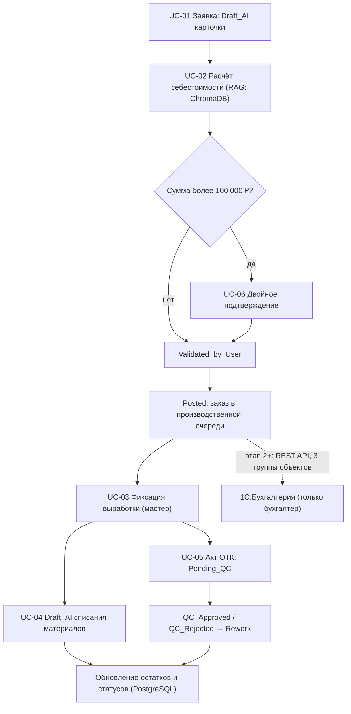
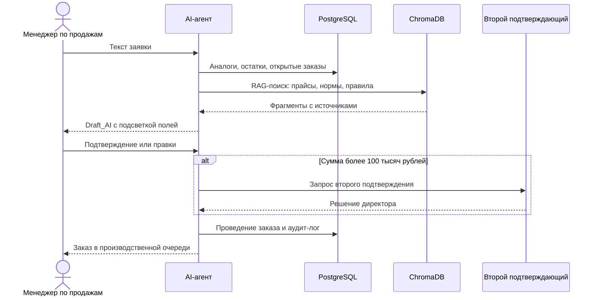
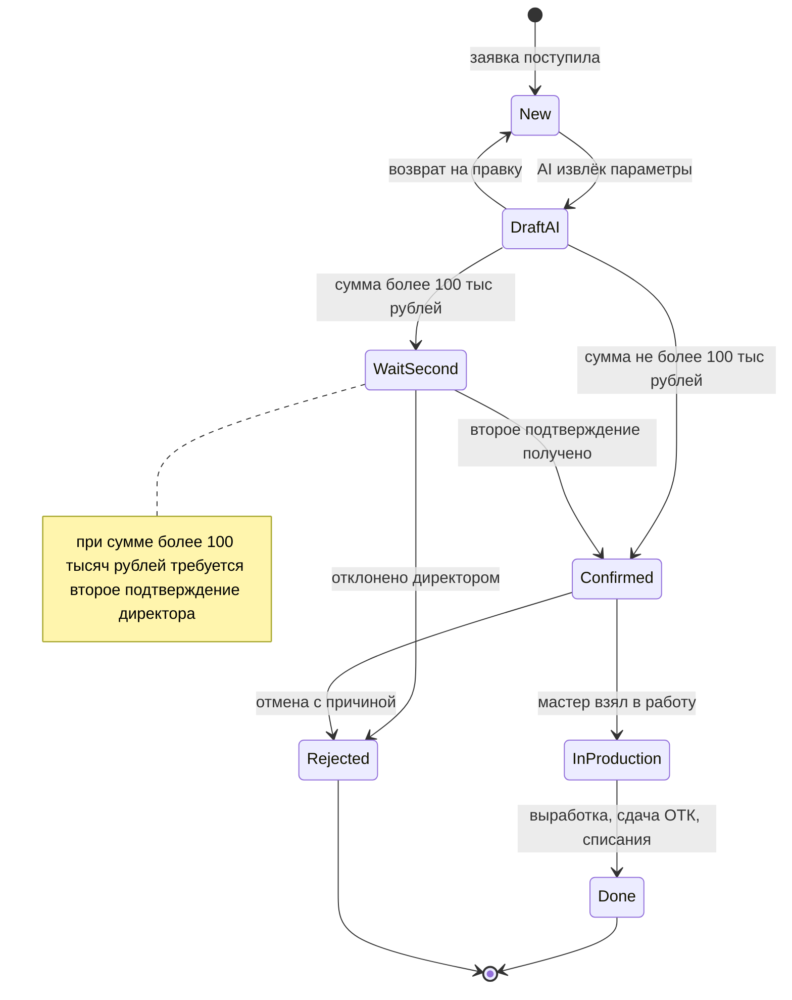

# ДОКУМЕНТ 3: АНАЛИТИЧЕСКИЙ ОТЧЁТ

## Проект «AI-Контур КБМ» — автоматизация операционного контура ООО «КубаньБурМаш»

**Аналитик:** Абрамов Андрей Васильевич, ООО «Автостар Плюс»  
**Дата:** 15 августа 2026 г.  
**Статус:** Готов для отчета (без подписания)  
**Базовые артефакты:** Документ 1 (Протокол встречи, 14.07.2026), Документ 2 (Систематизация данных, 20.07.2026)

---

## 1. Описание предметной области

**Контекст:** ООО «КубаньБурМаш» (КБМ) — производство буровых наконечников, 14 ролей сотрудников, собственная БД PostgreSQL + интеграция с 1С:Бухгалтерия через REST API (детали — Документ 2, §1-3).

**Границы анализа:** MVP (4 недели) — роли «Менеджер по продажам» и «Мастер цеха»; остальные роли — контекст последующих этапов.

**Ключевые архитектурные решения (фиксированы в Документе 2, §14):**

- Собственная БД PostgreSQL — основной источник данных для всех 14 ролей
- 1С:Бухгалтерия — только для бухгалтера; интеграция через REST API по 3 группам объектов (счета, выписки, акты)
- AI-агенты на базе Qwen с RAG по ChromaDB; запрет ответов «из головы»
- Все документы — черновики (Draft_AI); проведение только после подтверждения пользователем

---

## 2. Модель AS IS

> **Примечание:** Детальное описание процессов AS IS для обеих MVP-ролей (8 шагов менеджера, 6 шагов мастера) — **Документ 2, §5 и §8**. Ниже — аналитическая выжимка для обоснования точек автоматизации.

### 2.1 Сводные проблемы AS IS

| Проблема                                    | Влияние на бизнес                    | Частота          |
| ------------------------------------------- | ------------------------------------ | ---------------- |
| Ручной расчёт себестоимости в Excel         | 30-40 мин/заявка; риск ошибок маржи  | Ежедневно        |
| Дублирование данных между Excel и 1С        | Потеря времени; расхождения остатков | Ежедневно        |
| Бумажные сопроводительные листки в ОТК      | Потеря документов; споры по браку    | 10-15 мин/партия |
| Незаполненные колонки «Операции» мастерами  | Задержка зарплаты рабочих            | Еженедельно      |
| Нет оперативной аналитики по маржинальности | Решения принимаются с лагом 1-2 дня  | Постоянно        |

### 2.2 Протокол анализа методом трёх цветов (дельта)

> **Основной протокол:** Документ 1 (сводка 🟢/🟡/🔴). Ниже — **новые** уточнения и риски, выявленные при детальном анализе.

| 🟢 Факты (дополнительно)                                    | 🟡 Уточнения (для Доп. соглашения №1)                         | 🔴 Риски                                                                        |
| ----------------------------------------------------------- | ------------------------------------------------------------- | ------------------------------------------------------------------------------- |
| Договор подписан; бюджет 2 655 000 ₽ с НДС; 33 недели       | Каналы поступления заявок и доли (телефон/e-mail/мессенджеры) | Конфликт сроков: менеджер обещает «по опыту» vs мастер — по загрузке цеха       |
| Аудит-лог 1 год; RLS в рамках прав пользователя             | Источники/форматы прайсов на металлопрокат для ChromaDB       | Списания «по нормам» задним числом vs фактическая выдача → расхождение остатков |
| Деградация при недоступности 1С: режим «вопрос-ответ по БЗ» | Пороги скидок и полномочия (менеджер до 10% / директор до 5%) | Нагрузка на ВМ (6 vCPU / 11 GB RAM) при росте одновременных AI-запросов         |

---

## 3. Точки автоматизации (MoSCoW)

| ID  | Точка автоматизации                                           | Суть                                                        | Приоритет | MVP      |
| --- | ------------------------------------------------------------- | ----------------------------------------------------------- | --------- | -------- |
| A1  | Единый приём заявки (веб-чат)                                 | Автонумерация, история                                      | Must      | ✅       |
| A2  | AI-разбор заявки → Draft_AI                                   | Извлечение сущностей; подсветка confidence < 80%            | Must      | ✅       |
| A3  | Расчёт себестоимости через RAG                                | Только ChromaDB, с источниками; отказ при отсутствии данных | Must      | ✅       |
| A4  | Draft_AI заказа/КП                                            | Проведение после Validated_by_User                          | Must      | ✅       |
| A5  | Фиксация выработки                                            | Draft_AI сменного отчёта; валидация обязательных полей      | Must      | ✅       |
| A6  | Draft_AI акта ОТК и списания материалов                       | Нормативное списание + корректировка факта                  | Must      | ✅       |
| A7  | Статусная модель и аудит                                      | Статусы строго по Документу 2 §11; аудит 1 год              | Must      | ✅       |
| A8  | Двойное подтверждение > 100 000 ₽                             | Маршрут + фиксация решения                                  | Must      | ✅       |
| A9  | RBAC + RLS                                                    | MVP — 2 роли; архитектура прав — 14                         | Must      | ✅       |
| B1  | REST API с 1С (3 группы объектов)                             | Ретраи, лог обмена                                          | Should    | этап 2   |
| B2  | Уведомления о смене статусов                                  | Веб-уведомления                                             | Should    | частично |
| B3  | Дашборды (руководитель, инженер ПДО)                          | KPI по данным PostgreSQL                                    | Should    | этап 2   |
| C1  | Telegram-бот                                                  | Этап 4 (вопрос O-2 Документа 1)                             | Could     | этап 4   |
| C2  | Голосовой ввод (Whisper+TTS)                                  | Этап 4                                                      | Could     | этап 4   |
| W1  | Замена 1С:Бухгалтерия / АРМ бухгалтера                        | 1С — независимое приложение бухгалтера                      | Won't     | —        |
| W2  | Платёжные сервисы, не работающие в РФ (Apple Pay, Google Pay) | Вне области допустимого                                     | Won't     | —        |

### 3.1 Точки взаимодействия (Touchpoints)

> **Базовые touchpoints:** Документ 2, §4. **Дельта:**

| Touchpoint                                          | Кто / канал       | Действие системы                                                     |
| --------------------------------------------------- | ----------------- | -------------------------------------------------------------------- |
| Платёжный контур («Мир», ЮKassa, СберПэй, СБП)      | Клиент            | Безналичная оплата; статус оплаты — через банковские выписки из 1С   |
| Внешние каналы клиента (телефон/e-mail/мессенджеры) | Клиент → менеджер | Менеджер вставляет текст заявки в чат; AI структурирует              |
| Печатные формы (переходный период)                  | Цех               | Сопроводительный листок/требование из системы параллельно с Draft_AI |

---

## 4. Модель TO BE

> **Сценарии TO BE:** Документ 2, §6 (менеджер) и §9 (мастер). Ниже — явная карта действий системы и статусов.

### 4.1 Use Case (MVP)

| ID    | Сценарий                                                                      | Актор                          | Приоритет |
| ----- | ----------------------------------------------------------------------------- | ------------------------------ | --------- |
| UC-01 | Обработка заявки и формирование заказа (вкл. UC-02: расчёт себестоимости RAG) | Менеджер                       | Must      |
| UC-03 | Фиксация выработки, Draft_AI сменного отчёта                                  | Мастер                         | Must      |
| UC-04 | Draft_AI списания материалов                                                  | Мастер                         | Must      |
| UC-05 | Draft_AI сдачи партии в ОТК (Pending_QC)                                      | Мастер                         | Must      |
| UC-06 | Двойное подтверждение > 100 000 ₽                                             | Второй подтверждающий          | Must      |
| UC-07 | Просмотр статусов и журнала аудита (1 год)                                    | Менеджер, мастер, руководитель | Must      |

**UC-01 детально:**  
**Предусловия:** менеджер авторизован (RLS), БЗ доступна.  
**Основной поток:** ввод → Draft_AI (подсветка < 80%) → наличие/срок по PostgreSQL → RAG-расчёт с источниками → (при > 100 000 ₽ — UC-06) → Validated_by_User → Posted.  
**Альтернативы:** RAG не нашёл данных → отказ от ответа + задача ответственному (запрет «из головы»); Rejected → повторная генерация Draft_AI.  
**Постусловия:** Posted в PostgreSQL, аудит-запись.

### 4.2 Взаимосвязи сценариев (Mermaid)

---

## 5. Приоритизированный список требований (MoSCoW)

| ID    | Требование                                                                              | MoSCoW | MVP      |
| ----- | --------------------------------------------------------------------------------------- | ------ | -------- |
| FR-01 | Приём/регистрация заявок в веб-чате, единая история                                     | Must   | ✅       |
| FR-02 | AI-разбор → Draft_AI; проведение только после Validated_by_User                         | Must   | ✅       |
| FR-03 | Подсветка confidence < 80% + обязательная ручная сверка                                 | Must   | ✅       |
| FR-04 | Расчёт себестоимости строго по RAG с источниками; отказ при отсутствии данных           | Must   | ✅       |
| FR-05 | Статусная модель — строго по Документу 2 §11 (включая ОТК-цепочку)                      | Must   | ✅       |
| FR-06 | Фиксация выработки; Draft_AI сменного отчёта; валидация обязательных полей              | Must   | ✅       |
| FR-07 | Draft_AI списания по нормам с корректировкой факта; блокировка «расхода раньше прихода» | Must   | ✅       |
| FR-08 | Draft_AI акта сдачи в ОТК; Pending_QC → QC_Approved/QC_Rejected/Rework                  | Must   | ✅       |
| FR-09 | Аудит всех действий AI и пользователей; хранение 1 год                                  | Must   | ✅       |
| FR-10 | RBAC 14 ролей + RLS; секреты в Docker Secrets                                           | Must   | ✅       |
| FR-11 | Двойное подтверждение > 100 000 ₽                                                       | Must   | ✅       |
| FR-12 | Защита от дублирующих запросов: хэш-проверка, блокировка 60 с                           | Must   | ✅       |
| FR-13 | REST API с 1С по 3 группам; ретраи, лог обмена                                          | Should | этап 2   |
| FR-14 | Уведомления о смене статусов и задачах на подтверждение                                 | Should | частично |
| FR-15 | Дашборды руководителя/инженера ПДО                                                      | Should | этап 2   |
| FR-16 | Статусы оплат по банковским выпискам из 1С                                              | Should | этап 2   |
| FR-17 | Telegram-бот (наследуется вопрос O-2 Документа 1)                                       | Could  | этап 4   |
| FR-18 | Голосовой ввод (Whisper+TTS)                                                            | Could  | этап 4   |
| FR-19 | Предиктивный срок по загрузке цеха                                                      | Could  | —        |
| FR-20 | Замена 1С:Бухгалтерия / АРМ бухгалтера                                                  | Won't  | —        |
| FR-21 | Платёжные сервисы, не работающие в РФ (Apple Pay, Google Pay)                           | Won't  | —        |
| FR-22 | Нативные мобильные приложения                                                           | Won't  | —        |

### 5.1 Нефункциональные требования (NFR)

**Согласованные (Документ 1 блок 4, Документ 2 §12 — принимаются без изменений):**

| Метрика                         | Значение                                                 |
| ------------------------------- | -------------------------------------------------------- |
| Время ответа AI (p95)           | ≤ 5 с                                                    |
| Точность извлечения сущностей   | ≥ 95% (расхождение > 5% → уточнение)                     |
| Доступность                     | 99,5% в рабочие часы 08:00–18:00                         |
| SLA эскалации                   | ≤ 15 мин (2 нераспознанных запроса → Escalated_to_Human) |
| Время создания черновика        | ≤ 10 с                                                   |
| Интеграция с 1С                 | ≤ 30 с                                                   |
| Уведомление об ошибке           | ≤ 5 с                                                    |
| Деградация при недоступности 1С | Режим «вопрос-ответ по базе знаний» с уведомлением       |

**Предложения аналитика (требуют согласования):**

| Категория             | Предложение                                                            |
| --------------------- | ---------------------------------------------------------------------- |
| Надёжность            | Ночные бэкапы PostgreSQL; RPO ≤ 24 ч, RTO ≤ 4 ч                        |
| Производительность UI | Открытие экрана веб-чата ≤ 3 с                                         |
| Юзабилити             | Обучение MVP-ролей ≤ 2 часов; инструкции в ChromaDB                    |
| LLM-устойчивость      | Fallback при недоступности OpenRouter (резервная модель/очередь задач) |

---

## 6. Открытые вопросы к заказчику

**Часть А — наследуются из Документа 1 (O-1…O-5), выносятся в Доп. соглашение №1:**  
O-1 LLM-провайдер продакшена; O-2 Telegram в MVP; O-3 миграция Excel; O-4 админ-панель AI; O-5 спорные ситуации «мастер утверждает vs данных нет».

**Часть Б — новые вопросы текущего анализа (все — в Доп. соглашение №1):**

1. Шкала скидок и полномочия согласования?
2. Второй подтверждающий для > 100 000 ₽ и SLA подтверждения?
3. Каналы поступления заявок и доли для MVP?
4. Источники/форматы/периодичность прайсов на металлопрокат?
5. Порядок инвентаризации остатков на старт MVP?
6. Спецификации 3 групп объектов интеграции (поля, направления, периодичность)?
7. Этап интеграции с 1С: MVP (Документ 2, шаг 9 TO BE) или этап 9 плана (Документ 1)? Входит ли счёт клиенту в контур?
8. Требуется ли подтверждение акта ОТК контролёром в MVP?
9. Перечень печатных форм на переходный период?
10. Согласованные RPO/RTO и регламент бэкапов?
11. Регламент пополнения ChromaDB и ответственный за согласование документов?

---

**Статус документа:** Готов для отчета  
**Следующие шаги:** Документ 4 (Реестр требований / SRS) → Документ 5 (Техническое задание)

---

---

# ДОКУМЕНТ 4: РЕЕСТР ТРЕБОВАНИЙ (SRS)

## Спецификация требований к системе «AI-Контур КБМ»

**Аналитик:** Абрамов Андрей Васильевич, ООО «Автостар Плюс»  
**Дата:** 15 августа 2026 г.  
**Статус:** Готов для отчета (без подписания)  
**Базовые артефакты:** Документ 1 (Протокол встречи), Документ 2 (Систематизация данных), Документ 3 (Аналитический отчёт)

---

## А. Функциональные требования (ФТ)

| ID    | Название                              | Системное требование                                                                                                                                                                                              | Пояснение                                                           |
| ----- | ------------------------------------- | ----------------------------------------------------------------------------------------------------------------------------------------------------------------------------------------------------------------- | ------------------------------------------------------------------- |
| ФТ-01 | Приём и регистрация заявок            | Система должна обеспечивать приём заявок через веб-чат с автонумерацией, единой историей и привязкой к клиенту.                                                                                                   | Исключение потери заявок в личных переписках менеджера.             |
| ФТ-02 | AI-разбор заявки → Draft_AI           | Система должна извлекать сущности (клиент, товар, количество, срок) из текста заявки и создавать Draft_AI карточки. Поля с confidence < 80% подсвечиваются жёлтым.                                                | Автоматизация ручного ввода; визуальная индикация неопределённости. |
| ФТ-03 | Расчёт себестоимости через RAG        | Система должна рассчитывать себестоимость строго по данным из ChromaDB (прайсы, нормы, правила ценообразования) с указанием источников. При отсутствии данных — отказ от ответа и создание задачи ответственному. | Запрет галлюцинаций; прозрачность расчёта.                          |
| ФТ-04 | Проведение документов                 | Система должна проводить документы только после подтверждения пользователем (статус Validated_by_User → Posted). Прямой переход Draft_AI → Posted запрещён.                                                       | Контроль пользователя над действиями AI; минимизация ошибок.        |
| ФТ-05 | Статусная модель заказа/партии        | Система должна поддерживать статусы: Draft_AI → Validated_by_User → Posted → Synced_to_1C / Archived; для ОТК: Pending_QC → QC_Approved / QC_Rejected → Rework.                                                   | Сквозная прослеживаемость; согласовано с Документом 2 §11.          |
| ФТ-06 | Фиксация выработки                    | Система должна создавать Draft_AI сменного отчёта с валидацией обязательных полей (изделие, количество, исполнители, материалы, операции).                                                                        | Исключение незаполненных колонок «Операции» → задержка зарплаты.    |
| ФТ-07 | Списание материалов                   | Система должна создавать Draft_AI списания по нормам от выработки (RAG) с возможностью корректировки факта мастером. Блокировка «расхода раньше прихода».                                                         | Точный учёт остатков; предотвращение «минуса на складе».            |
| ФТ-08 | Акт сдачи в ОТК                       | Система должна создавать Draft_AI акта сдачи партии в ОТК с составом партии; статус Pending_QC до подтверждения контролёром.                                                                                      | Прослеживаемость партий; учёт брака.                                |
| ФТ-09 | Журнал аудита                         | Система должна логировать все действия AI и пользователей: кто, что спросил, какой черновик создан, время ответа, решения. Срок хранения: 1 год. Формат: JSON, защита от модификации.                             | Расследование инцидентов; соответствие требованиям безопасности.    |
| ФТ-10 | RBAC + RLS                            | Система должна обеспечивать ролевой доступ (MVP — 2 роли; архитектура — 14 ролей). AI-агент действует строго в правах авторизованного пользователя (RLS). Секреты — только Docker Secrets/.env.                   | Безопасность; разграничение полномочий.                             |
| ФТ-11 | Двойное подтверждение                 | Система должна маршрутизировать Draft_AI на второе подтверждение при сумме > 100 000 ₽. Фиксация решения в аудите.                                                                                                | Контроль критичных операций; согласование с директором.             |
| ФТ-12 | Защита от дублирующих запросов        | Система должна проверять хэш запроса и блокировать дубликаты в течение 60 секунд.                                                                                                                                 | Предотвращение двойного создания документов.                        |
| ФТ-13 | REST API с 1С:Бухгалтерия             | Система должна интегрироваться с 1С через REST API по 3 группам объектов (счета на оплату контрагентам, банковские выписки, акты выполненных работ) с ретрами и логом обмена. SLA: ≤ 30 с на операцию.            | Автоматическая синхронизация бухгалтерских документов; этап 2.      |
| ФТ-14 | Уведомления о смене статусов          | Система должна отправлять веб-уведомления менеджеру/мастеру/директору при смене статусов и появлении задач на подтверждение.                                                                                      | Оперативное информирование; частично в MVP.                         |
| ФТ-15 | Дашборды руководителя                 | Система должна предоставлять дашборды KPI (маржинальность, НЗП, брак, загрузка цехов) по данным PostgreSQL.                                                                                                       | Оперативная аналитика; этап 2.                                      |
| ФТ-16 | Статусы оплат                         | Система должна обновлять статусы заказов по банковским выпискам из 1С (группа 2).                                                                                                                                 | Автоматическая сверка оплат; этап 2.                                |
| ФТ-17 | Telegram-бот                          | Система должна поддерживать Telegram-бот для уведомлений и простых подтверждений.                                                                                                                                 | Мобильность; этап 4 (вопрос O-2 Документа 1).                       |
| ФТ-18 | Голосовой ввод                        | Система должна поддерживать голосовой ввод выработки (Whisper + TTS) для мастеров в цеху.                                                                                                                         | Удобство в производственных условиях; этап 4.                       |
| ФТ-19 | Предиктивный срок                     | Система должна прогнозировать срок выполнения заказа на основе истории и загрузки цеха.                                                                                                                           | Улучшение планирования; опционально.                                |
| ФТ-20 | Замена 1С:Бухгалтерия                 | **Не реализуется.** 1С:Бухгалтерия остаётся независимым приложением бухгалтера.                                                                                                                                   | Архитектурное решение; Документ 2 §14.                              |
| ФТ-21 | Платёжные сервисы, не работающие в РФ | **Не реализуется.** Apple Pay, Google Pay не используются (не работают в РФ).                                                                                                                                     | Российская специфика; только «Мир», ЮKassa, СберПэй, СБП.           |
| ФТ-22 | Нативные мобильные приложения         | **Не реализуется.** Достаточно адаптивного веб-чата.                                                                                                                                                              | Оптимизация бюджета и сроков.                                       |

---

## Б. Нефункциональные требования (НФТ)

| ID     | Название                        | Характеристика              | Значение (Метрика)                                                  | Пояснение                                                                                          |
| ------ | ------------------------------- | --------------------------- | ------------------------------------------------------------------- | -------------------------------------------------------------------------------------------------- |
| НФТ-01 | Время ответа AI                 | Производительность          | p95 ≤ 5 секунд                                                      | При стабильном интернете и доступности LLM API; согласовано с Документом 1 блок 4.                 |
| НФТ-02 | Точность извлечения сущностей   | Качество AI                 | ≥ 95%                                                               | Для структурированных данных (сумма, дата, номенклатура); при расхождении > 5% — запрос уточнения. |
| НФТ-03 | Доступность системы             | Надёжность                  | 99,5% в рабочие часы (08:00–18:00)                                  | Плановые работы 1С не учитываются; согласовано с Документом 2 §12.                                 |
| НФТ-04 | SLA эскалации                   | Оперативность               | ≤ 15 минут                                                          | При 2 нераспознанных запросах подряд → Escalated_to_Human (создание тикета для админа).            |
| НФТ-05 | Время создания черновика        | Производительность          | ≤ 10 секунд                                                         | От запроса пользователя до создания Draft_AI в БД.                                                 |
| НФТ-06 | Интеграция с 1С                 | Производительность          | ≤ 30 секунд                                                         | Время передачи данных в 1С через REST API; этап 2.                                                 |
| НФТ-07 | Уведомление об ошибке           | Оперативность               | ≤ 5 секунд                                                          | Время уведомления пользователя об ошибке (недоступность БД, 1С, LLM).                              |
| НФТ-08 | Деградация при недоступности 1С | Надёжность                  | Режим «вопрос-ответ по базе знаний» с уведомлением                  | Частичная доступность; AI работает только с ChromaDB до восстановления связи.                      |
| НФТ-09 | Резервное копирование           | Надёжность                  | RPO ≤ 24 ч, RTO ≤ 4 ч                                               | Ночные бэкапы PostgreSQL; восстановление ≤ 4 часов (предложение аналитика).                        |
| НФТ-10 | Производительность UI           | Юзабилити                   | Открытие экрана веб-чата ≤ 3 с                                      | Комфортный UX; предложение аналитика.                                                              |
| НФТ-11 | Обучение пользователей          | Юзабилити                   | ≤ 2 часов для MVP-ролей                                             | Инструкции в ChromaDB; предложение аналитика.                                                      |
| НФТ-12 | LLM-устойчивость                | Надёжность                  | Fallback при недоступности OpenRouter                               | Резервная модель или очередь задач; запрет галлюцинаций системными промптами.                      |
| НФТ-13 | Безопасность данных             | Информационная безопасность | TLS; данные в контуре ВМ Заказчика; 152-ФЗ                          | Защита персональных данных; соответствие законодательству РФ.                                      |
| НФТ-14 | Хранение аудит-лога             | Аудит / Безопасность        | Срок хранения: 1 год; формат JSON; защита от модификации            | Расследование инцидентов; согласовано с Документом 1 блок 3.                                       |
| НФТ-15 | Развёртывание                   | Инфраструктура              | Docker-контейнеры на ВМ Заказчика (Ubuntu 22.04, 6 vCPU, 11 GB RAM) | Использование существующей инфраструктуры; согласовано с Документом 1 блок 3.                      |

---

## В. Ограничения и допущения

### В.1 Ограничения

| ID   | Ограничение                                                                 | Источник                                            |
| ---- | --------------------------------------------------------------------------- | --------------------------------------------------- |
| O-01 | Бюджет: 2 655 000 ₽ (с НДС)                                                 | Договор; Доп. соглашение №1                         |
| O-02 | Срок: 33 недели (полное внедрение), MVP — 4 недели                          | Договор; Доп. соглашение №1                         |
| O-03 | Расчёты — исключительно безналичные по расчётным счетам                     | Российская специфика                                |
| O-04 | Платёжные сервисы: только «Мир», ЮKassa, СберПэй, СБП                       | Не работают в РФ: Apple Pay, Google Pay             |
| O-05 | 1С:Бухгалтерия — только для бухгалтера; интеграция по 3 группам объектов    | Архитектурное решение; Документ 2 §14               |
| O-06 | Все документы — черновики (Draft_AI); проведение только после подтверждения | Согласовано с администратором 1С; Документ 1 блок 2 |
| O-07 | Развёртывание — Docker на ВМ Заказчика (Ubuntu 22.04, 6 vCPU, 11 GB RAM)    | Существующая инфраструктура; Документ 1 блок 3      |

### В.2 Допущения

| ID   | Допущение                                        | Обоснование                                                        | Статус                |
| ---- | ------------------------------------------------ | ------------------------------------------------------------------ | --------------------- |
| A-01 | RPO ≤ 24 ч, RTO ≤ 4 ч                            | Стандартная практика для production-систем; требует согласования   | Требует подтверждения |
| A-02 | Обучение MVP-ролей ≤ 2 часов                     | Простой интерфейс веб-чата; инструкции в ChromaDB                  | Требует подтверждения |
| A-03 | Fallback LLM: резервная модель или очередь задач | Обеспечение доступности при сбое OpenRouter                        | Требует подтверждения |
| A-04 | Открытие экрана веб-чата ≤ 3 с                   | Комфортный UX на ВМ Заказчика                                      | Требует подтверждения |
| A-05 | Интеграция с 1С — этап 2 (не в MVP)              | Приоритет MVP: веб-чат + Draft_AI; интеграция — после стабилизации | Согласовано           |
| A-06 | Telegram-бот — этап 4                            | Вопрос O-2 Документа 1; приоритет — веб-чат                        | Требует подтверждения |
| A-07 | Голосовой ввод — этап 4                          | Опционально; приоритет — текстовый ввод                            | Требует подтверждения |

---

## Г. Сводная статистика

| Категория                         | Количество |
| --------------------------------- | ---------- |
| Функциональные требования (ФТ)    | 22         |
| Нефункциональные требования (НФТ) | 15         |
| Ограничения (O)                   | 7          |
| Допущения (A)                     | 7          |
| **Всего**                         | **51**     |

### Распределение по приоритетам (MoSCoW)

| Приоритет   | Количество       |
| ----------- | ---------------- |
| Must Have   | 12 (ФТ-01…ФТ-12) |
| Should Have | 4 (ФТ-13…ФТ-16)  |
| Could Have  | 3 (ФТ-17…ФТ-19)  |
| Won't Have  | 3 (ФТ-20…ФТ-22)  |

---
