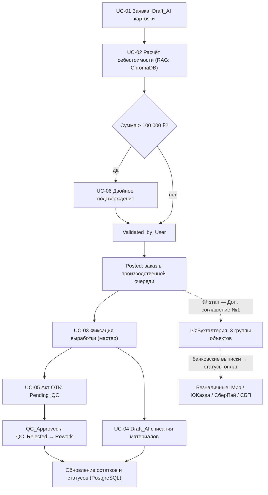
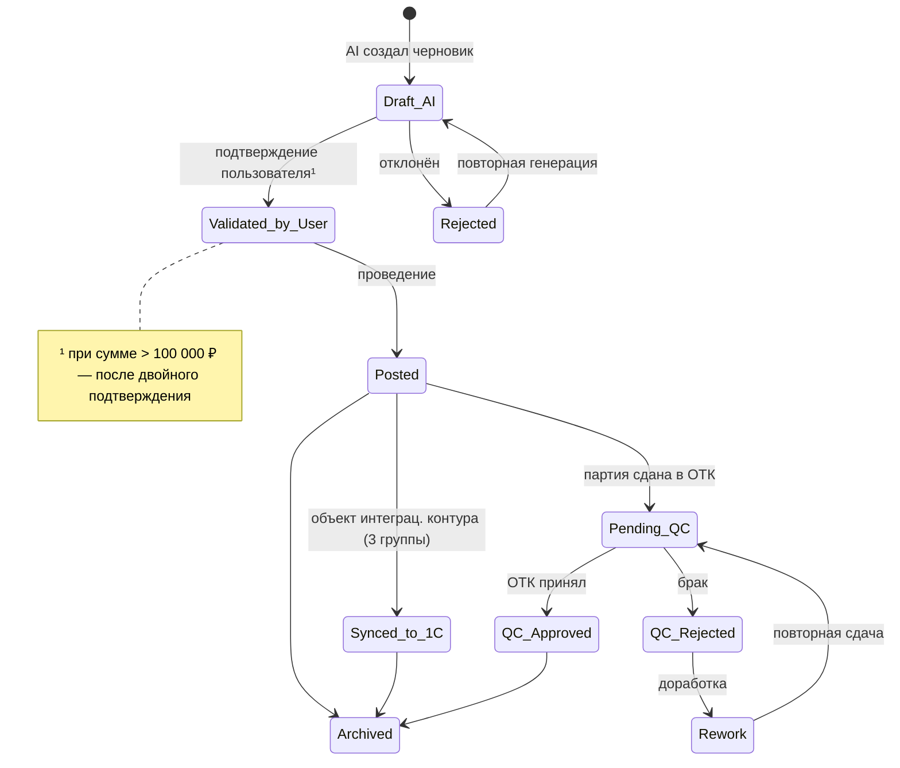

# АНАЛИТИЧЕСКИЙ ОТЧЁТ

## Проект «AI‑Контур КБМ» — автоматизация операционного контура ООО «КубаньБурМаш»

| Параметр          | Значение                                                                                                                                                                   |
| ----------------- | -------------------------------------------------------------------------------------------------------------------------------------------------------------------------- |
| Заказчик          | ООО «КубаньБурМаш» (КБМ), г. Краснодар                                                                                                                                     |
| Исполнитель       | ООО «Автостар Плюс»                                                                                                                                                        |
| Аналитик          | Абрамов Андрей Васильевич                                                                                                                                                  |
| Со стороны КБМ    | Нагорный П. В. (директор) и др. — 14 участников, полный состав в Документе 1                                                                                               |
| Дата отчёта       | 15 августа 2026 г. (редакция 2: дедупликация с Документами 1–2)                                                                                                            |
| Основание         | Договор подписан; изменения — через Дополнительное соглашение №1                                                                                                           |
| Бюджет / срок     | 2 655 000 ₽ (с НДС) / 33 недели; MVP — 4 недели. _Сноска: в Документе 1 — преддоговорная оценка 6 155 000 ₽ б/НДС и 63 недели; итоговые цифры — по подписанному договору._ |
| Базовые артефакты | Документ 1 (14.07.2026, согласован), Документ 2 (20.07.2026, согласован)                                                                                                   |
| Статус            | Проект для согласования с КБМ                                                                                                                                              |

## 1. Описание предметной области

ООО «КубаньБурМаш» — производство буровых наконечников (металлообработка, сварка, термообработка, контроль ОТК; серийное и заказное производство). Штат 30+ сотрудников, **14 ролей — по согласованной ролевой модели (Документ 2, §2)**.

**Текущий ландшафт (детально — Документ 1, блоки 1–2):** операционный учёт — бумага/Excel/телефон; дублирование ввода; неактуальные остатки; ручной расчёт себестоимости; саботаж сложной учётной системы производственным персоналом. 1С:Бухгалтерия — только у бухгалтера. _Ранее в документации фигурировал ошибочный интеграционный контур; единственно верный зафиксирован в Документе 2._

**Целевой контур (фиксировано в Документе 2, §14):**

- Собственная БД приложения (**PostgreSQL**) — основной источник данных для всех 14 ролей;
- 1С:Бухгалтерия и приложение сотрудников — **два независимых приложения**; обмен только REST API и только по 3 группам объектов: **счета на оплату контрагентам; банковские выписки; акты выполненных работ**;
- AI‑агенты **Qwen** (MVP — OpenRouter API, продакшен — прямой API) с **RAG по ChromaDB**; запрет ответов «из головы»;
- Интерфейс — адаптивный веб‑чат; Telegram‑бот и голосовой ввод (Whisper+TTS) — опционально, этап 4;
- Развёртывание — Docker на ВМ Заказчика (Ubuntu 22.04, 6 vCPU, 11 GB RAM).

**Принципы работы AI (фиксированы в Документах 1–2):** все документы — черновики **Draft_AI**, проведение только после подтверждения пользователем (прямой переход Draft_AI→Posted запрещён); confidence < 80% — жёлтая подсветка; суммы > 100 000 ₽ — двойное подтверждение; **RLS** — AI действует строго в правах авторизованного пользователя; **полный аудит, срок хранения 1 год**; секреты — только Docker Secrets/.env.

**Платёжная специфика:** расчёты — исключительно безналичные по расчётным счетам; «Мир», ЮKassa, СберПэй, СБП. ❌ Apple Pay / Google Pay не используются (не работают в РФ).

**Границы анализа:** MVP — «Менеджер по продажам» и «Мастер цеха» (процессы согласованы в Документе 2, §5–10); остальные роли — контекст этапов 2+.

## 2. Модель AS IS

> Процессы AS IS по обеим MVP‑ролям **полностью описаны и согласованы в Документе 2 (§5, §8)**, включая альтернативные и ошибочные сценарии. Повторное изложение исключено; ниже — аналитическая выжимка, необходимая для обоснования точек автоматизации (раздел 3).

| Процесс (Док. 2)                                               | Трудозатраты (согл.) | Ключевые проблемы (согл.)                                                                | Вывод отчёта                                                                |
| -------------------------------------------------------------- | -------------------- | ---------------------------------------------------------------------------------------- | --------------------------------------------------------------------------- |
| А. Обработка заявки и расчёт себестоимости (менеджер), 8 шагов | 30–40 мин/заявка     | Ручной расчёт в Excel; дублирование Excel↔1С; нет оперативной маржинальности             | Автоматизация шагов 2–6 (извлечение сущностей, расчёт, черновик) — ядро MVP |
| Б. Сдача в ОТК и учёт выработки (мастер), 6 шагов              | 10–15 мин/партия     | 7 колонок вручную; незаполненные «Операции» → задержка зарплаты; дублирование мастер↔ОТК | Автоматизация шагов 2–5 (Draft_AI отчёта, акта ОТК, списания) — ядро MVP    |

**Сводные проблемы AS IS:** скорость и ошибки ручного расчёта; потеря и дублирование документов; расхождения фактических и учётных остатков; отсутствие сквозных статусов; отвлечение бухгалтера на непрофильный ввод.

### 2.1 Протокол анализа методом трёх цветов

> Основной трёхцветный протокол согласован в **Документе 1** (сводка 🟢/🟡/🔴, вопросы Y‑01…Y‑05, противоречия C‑01…C‑04). Ниже — **дельта** текущего анализа; всё, что совпадает с Документом 1, не повторяется.

| 🟢 Факты (доп. фиксация для логики отчёта; детали — Док. 1–2)                                       | 🟡 Новые уточнения (в Доп. соглашение №1)                                                                        | 🔴 Новые риски / противоречия                                                      |
| --------------------------------------------------------------------------------------------------- | ---------------------------------------------------------------------------------------------------------------- | ---------------------------------------------------------------------------------- |
| Договорные цифры: 2 655 000 ₽ с НДС, 33 недели, MVP 4 недели; демо MVP — 15.08.2026 по плану Док. 1 | Каналы поступления заявок и их доли (телефон/e‑mail/мессенджеры) — для входа MVP                                 | Менеджер обещает сроки «по опыту» vs мастер — по загрузке цеха → конфликт сроков   |
| Аудит‑лог 1 год; RLS в рамках прав пользователя; секреты в Docker Secrets (Док. 1)                  | Источники/форматы/периодичность прайсов на металлопрокат для ChromaDB                                            | Списания «по нормам» задним числом vs фактическая выдача → расхождение остатков    |
| Деградация при недоступности 1С: режим «вопрос‑ответ по базе знаний» с уведомлением (Док. 1)        | Пороги скидок и полномочия согласования (менеджер до 10% / директор до 5%)                                       | Нагрузка на ВМ (6 vCPU / 11 GB RAM) при росте одновременных AI‑запросов            |
| Рабочие часы 08:00–18:00 (SLA Док. 2)                                                               | Второй подтверждающий для > 100 000 ₽ и SLA подтверждения                                                        | Переходный период: бумажные формы дублируют электронные («двойная работа» мастера) |
|                                                                                                     | Этап интеграции с 1С: шаг 9 TO BE Док. 2 (в MVP) vs этап 9 плана Док. 1; входит ли счёт клиенту в контур 3 групп | Риск двойного учёта при параллельном вводе в операционном контуре и 1С             |
|                                                                                                     | Состав полей/форматы 3 групп объектов; периодичность обмена; RPO/RTO; регламент пополнения ChromaDB              |                                                                                    |

### 2.2 Ролевая модель и карта целей

> Полная модель 14 ролей и карта целей/конфликтов **согласованы в Документе 2 (§2–3)**; состав ролей: 1 менеджер по продажам (MVP), 2 мастер цеха (MVP), 3 инженер ПДО, 4 снабженец, 5 кладовщик, 6 контролёр ОТК, 7 экономист, 8 бухгалтер, 9 главный инженер, 10 технолог, 11 нормировщик, 12 руководитель, 13 администратор 1С, 14 кадровик. Ниже — детализация MVP‑ролей (дельта отчёта).

| Роль (ФИО по Док. 1)         | Цели                                                       | Конфликт                                                      | Разрешение в TO BE                                                                                     |
| ---------------------------- | ---------------------------------------------------------- | ------------------------------------------------------------- | ------------------------------------------------------------------------------------------------------ |
| Менеджер по продажам         | Быстрый ответ клиенту; точная маржа; минимум ручного ввода | С директором — по скидкам (🟡 пороги); с мастером — по срокам | RAG‑расчёт с источниками; срок по данным PostgreSQL; формализованная шкала скидок (Доп. соглашение №1) |
| Мастер цеха (Водякина Е. С.) | Минимум «бумаги»; точный учёт выработки/списаний           | С экономистом — точность ввода; с кладовщиком — остатки       | Draft_AI с валидацией обязательных полей (согл. Док. 2, §3); фактические остатки в единой БД           |

Согласованные конфликты «мастер vs экономист», «админ 1С vs внедрение», «руководитель vs персонал» и их разрешения — Документ 2, §3 (не дублирую).

## 3. Точки автоматизации (MoSCoW)

| ID  | Точка                                                         | Суть                                                                    | MoSCoW   | MVP      |
| --- | ------------------------------------------------------------- | ----------------------------------------------------------------------- | -------- | -------- |
| A1  | Единый приём заявки (веб‑чат)                                 | Автонумерация, история; вход — текст/вставка письма                     | Must     | ✅       |
| A2  | AI‑разбор заявки → Draft_AI                                   | Извлечение сущностей; подсветка confidence < 80%                        | Must     | ✅       |
| A3  | Расчёт себестоимости через RAG                                | Только ChromaDB, с источниками; отказ при отсутствии данных             | Must     | ✅       |
| A4  | Draft_AI заказа/КП                                            | Проведение после Validated_by_User                                      | Must     | ✅       |
| A5  | Фиксация выработки                                            | Draft_AI сменного отчёта; валидация обязательных полей                  | Must     | ✅       |
| A6  | Draft_AI акта ОТК и списания материалов                       | Нормативное списание + корректировка факта; передача в ОТК (Pending_QC) | Must     | ✅       |
| A7  | Статусная модель и аудит                                      | Статусы строго по Док. 2 §11; аудит 1 год                               | Must     | ✅       |
| A8  | Двойное подтверждение > 100 000 ₽                             | Маршрут + фиксация решения (второй подтверждающий — 🟡)                 | Must     | ✅       |
| A9  | RBAC + RLS                                                    | MVP — 2 роли; архитектура прав — 14; AI в правах пользователя           | Must     | ✅       |
| B1  | REST API с 1С (3 группы объектов)                             | Ретраи, лог обмена. **🟡 этап — Доп. соглашение №1** (см. §2.1 🔴)      | Should\* | \*уточн. |
| B2  | Уведомления о смене статусов                                  | Веб‑уведомления                                                         | Should   | частично |
| B3  | Дашборды (руководитель, инженер ПДО)                          | KPI по данным PostgreSQL (согл. Док. 2, роль 12)                        | Should   | этап 2   |
| C1  | Telegram‑бот                                                  | Этап 4 (вопрос O‑2 Док. 1 наследуется)                                  | Could    | этап 4   |
| C2  | Голосовой ввод (Whisper+TTS)                                  | Этап 4 (согл. Док. 2, §4)                                               | Could    | этап 4   |
| C3  | Предиктивный срок по загрузке цеха                            | Аналитика истории заказов                                               | Could    | —        |
| W1  | Замена 1С:Бухгалтерия / АРМ бухгалтера                        | 1С — независимое приложение бухгалтера                                  | Won't    | —        |
| W2  | Платёжные сервисы, не работающие в РФ (Apple Pay, Google Pay) | Вне области допустимого                                                 | Won't    | —        |
| W3  | Нативные мобильные приложения                                 | Достаточно адаптивного веб‑чата                                         | Won't    | —        |

### 3.1 Точки взаимодействия (Touchpoints)

> Базовые touchpoints согласованы в **Документе 2, §4** (веб‑чат; Telegram/голос — этап 4; PostgreSQL; REST API 1С; ChromaDB; OpenRouter/Qwen; ВМ Заказчика). Дельта отчёта:

| Touchpoint (дельта)                                 | Кто / канал       | Действие системы                                                              |
| --------------------------------------------------- | ----------------- | ----------------------------------------------------------------------------- |
| Платёжный контур («Мир», ЮKassa, СберПэй, СБП)      | Клиент            | Безналичная оплата; статус оплаты — через банковские выписки из 1С (группа 2) |
| Внешние каналы клиента (телефон/e‑mail/мессенджеры) | Клиент → менеджер | Менеджер вставляет текст заявки в чат; AI структурирует (🟡 доли каналов)     |
| Печатные формы (переходный период)                  | Цех               | Сопроводительный листок/требование из системы параллельно с Draft_AI          |

## 4. Модель TO BE

> Сценарии TO BE по MVP‑ролям **согласованы в Документе 2 (§6, §9)** вместе с таблицами «что изменилось» (30–40 мин → 2–3 мин; 10–15 мин → 1–2 мин). Отчёт добавляет явную карту действий системы и статусов; при расхождении приоритет у Документа 2.

**Процесс А‑TO BE «Заявка → заказ»** (номера шагов — по Док. 2, §6):

| Шаги Док. 2 | Участник | Действия системы «AI‑Контур»                                                                                                                               |
| ----------- | -------- | ---------------------------------------------------------------------------------------------------------------------------------------------------------- |
| 1–2         | Менеджер | Система: извлечение сущностей; при confidence < 80% — жёлтая подсветка и уточнение (E1); нестандартная номенклатура — варианты «НБ‑120/НБ‑150» (A1)        |
| 3–4         | —        | Система: себестоимость из собственной БД/RAG; маржинальность; при недоступности БД — тикет мониторинга, цель не достигнута (E2)                            |
| 5–7         | Менеджер | Система: Draft_AI заказа; валидация (E3); правки; **Validated_by_User**; при > 100 000 ₽ — двойное подтверждение                                           |
| 8           | —        | Система: **Posted** в PostgreSQL; аудит                                                                                                                    |
| 9–10        | —        | Система: для объектов интеграционного контура — **Synced_to_1C** (≤ 30 с; при недоступности 1С — локальный кэш и уведомление, E4); подтверждение менеджеру |

**Процесс Б‑TO BE «Выработка → ОТК»** (по Док. 2, §9): извлечение сущностей из голосового/текстового ввода → сверка со справочниками → Draft_AI «Отчёта производства за смену» + Draft_AI «Акта контроля качества» → Validated_by_User → Posted → **Pending_QC** → QC_Approved / QC_Rejected→Rework; «минус на складе» — предупреждение и выбор действия (E2 Док. 2).

### 4.1 Use Case (MVP)

| ID    | Сценарий                                                                              | Актор                          | Приоритет |
| ----- | ------------------------------------------------------------------------------------- | ------------------------------ | --------- |
| UC‑01 | Обработка заявки и формирование заказа (вкл. UC‑02 include: расчёт себестоимости RAG) | Менеджер                       | Must      |
| UC‑03 | Фиксация выработки, Draft_AI сменного отчёта                                          | Мастер                         | Must      |
| UC‑04 | Draft_AI списания материалов                                                          | Мастер                         | Must      |
| UC‑05 | Draft_AI сдачи партии в ОТК (Pending_QC)                                              | Мастер                         | Must      |
| UC‑06 | Двойное подтверждение > 100 000 ₽                                                     | Второй подтверждающий (🟡)     | Must      |
| UC‑07 | Просмотр статусов и журнала аудита (1 год)                                            | Менеджер, мастер, руководитель | Must      |

**UC‑01:** предусловия — менеджер авторизован (RLS), БЗ доступна. Основной поток: ввод → Draft_AI (подсветка < 80%) → наличие/срок по PostgreSQL → RAG‑расчёт с источниками → (при > 100 000 ₽ — UC‑06) → Validated_by_User → Posted. Альтернативы: RAG не нашёл данных → отказ от ответа + задача ответственному (запрет «из головы»); Rejected → повторная генерация Draft_AI. Постусловия: Posted в PostgreSQL, аудит‑запись.
**UC‑03:** предусловия — есть задания из Posted‑заказов. Поток: выбор задания → ввод количества → Draft_AI (сверка с нормами, подсветка отклонений) → Validated_by_User → Posted → Pending_QC + Draft_AI списания. Альтернативы: отклонение от нормы выше порога (🟡) → ручная сверка; частичная сдача → акт ОТК на часть партии.

### 4.2 Взаимосвязи сценариев (Mermaid)



```mermaid
sequenceDiagram
    actor M as Менеджер по продажам
    participant AI as AI-агент (веб-чат)
    participant DB as PostgreSQL
    participant V as ChromaDB (RAG)
    participant C1 as Второй подтверждающий
    M->>AI: Текст заявки
    AI->>DB: Аналоги, остатки, открытые заказы
    AI->>V: RAG-поиск: прайсы, нормы, правила
    V-->>AI: Фрагменты с источниками
    AI-->>M: Draft_AI (confidence по полям; <80% — жёлтым)
    M->>AI: Validated_by_User / правки
    alt Сумма > 100 000 ₽
        AI->>C1: Запрос второго подтверждения
        C1-->>AI: Решение (аудит)
    end
    AI->>DB: Posted + аудит-лог
    AI-->>M: Заказ в производственной очереди
```



## 5. Приоритизированный список требований (MoSCoW)

| ID    | Требование                                                                                                 | MoSCoW   | MVP      |
| ----- | ---------------------------------------------------------------------------------------------------------- | -------- | -------- |
| FR‑01 | Приём/регистрация заявок в веб‑чате, единая история                                                        | Must     | ✅       |
| FR‑02 | AI‑разбор → Draft_AI; проведение только после Validated_by_User                                            | Must     | ✅       |
| FR‑03 | Подсветка confidence < 80% + обязательная ручная сверка                                                    | Must     | ✅       |
| FR‑04 | Расчёт себестоимости строго по RAG с источниками; отказ при отсутствии данных                              | Must     | ✅       |
| FR‑05 | Статусная модель — строго по Док. 2 §11 (включая ОТК‑цепочку и AI‑сессии)                                  | Must     | ✅       |
| FR‑06 | Фиксация выработки; Draft_AI сменного отчёта; валидация обязательных полей                                 | Must     | ✅       |
| FR‑07 | Draft_AI списания по нормам с корректировкой факта; блокировка «расхода раньше прихода» (согл. Док. 1, E2) | Must     | ✅       |
| FR‑08 | Draft_AI акта сдачи в ОТК; Pending_QC → QC_Approved/QC_Rejected/Rework                                     | Must     | ✅       |
| FR‑09 | Аудит всех действий AI и пользователей; хранение 1 год (фиксировано Док. 1)                                | Must     | ✅       |
| FR‑10 | RBAC 14 ролей + RLS; секреты в Docker Secrets (фиксировано Док. 1)                                         | Must     | ✅       |
| FR‑11 | Двойное подтверждение > 100 000 ₽                                                                          | Must     | ✅       |
| FR‑12 | Защита от дублирующих запросов: хэш‑проверка, блокировка 60 с (фиксировано Док. 1, E3)                     | Must     | ✅       |
| FR‑13 | REST API с 1С по 3 группам; ретраи, лог обмена. **🟡 этап — Доп. соглашение №1**                           | Should\* | \*уточн. |
| FR‑14 | Уведомления о смене статусов и задачах на подтверждение                                                    | Should   | частично |
| FR‑15 | Дашборды руководителя/инженера ПДО                                                                         | Should   | этап 2   |
| FR‑16 | Статусы оплат по банковским выпискам из 1С (группа 2)                                                      | Should   | этап 2   |
| FR‑17 | Telegram‑бот (наследуется вопрос O‑2 Док. 1)                                                               | Could    | этап 4   |
| FR‑18 | Голосовой ввод (Whisper+TTS)                                                                               | Could    | этап 4   |
| FR‑19 | Предиктивный срок по загрузке цеха                                                                         | Could    | —        |
| FR‑20 | Замена 1С:Бухгалтерия / АРМ бухгалтера                                                                     | Won't    | —        |
| FR‑21 | Платёжные сервисы, не работающие в РФ (Apple Pay, Google Pay)                                              | Won't    | —        |
| FR‑22 | Нативные мобильные приложения                                                                              | Won't    | —        |

### 5.1 Нефункциональные требования (NFR)

**Согласованные (Док. 1 блок 4, Док. 2 §12 — принимаются без изменений):**

| Метрика                         | Значение                                                 |
| ------------------------------- | -------------------------------------------------------- |
| Время ответа AI (p95)           | ≤ 5 с                                                    |
| Точность извлечения сущностей   | ≥ 95% (расхождение > 5% → уточнение)                     |
| Доступность                     | 99,5% в рабочие часы 08:00–18:00                         |
| SLA эскалации                   | ≤ 15 мин (2 нераспознанных запроса → Escalated_to_Human) |
| Время создания черновика        | ≤ 10 с                                                   |
| Интеграция с 1С                 | ≤ 30 с                                                   |
| Уведомление об ошибке           | ≤ 5 с                                                    |
| Деградация при недоступности 1С | Режим «вопрос‑ответ по базе знаний» с уведомлением       |

**Предложения аналитика (требуют согласования — в Доп. соглашение №1):**

| Категория             | Предложение                                                            |
| --------------------- | ---------------------------------------------------------------------- |
| Надёжность            | Ночные бэкапы PostgreSQL; RPO ≤ 24 ч, RTO ≤ 4 ч                        |
| Производительность UI | Открытие экрана веб‑чата ≤ 3 с                                         |
| Юзабилити             | Обучение MVP‑ролей ≤ 2 часов; инструкции в ChromaDB                    |
| LLM‑устойчивость      | Fallback при недоступности OpenRouter (резервная модель/очередь задач) |

## 6. Открытые вопросы к заказчику

**Часть А — наследуются из Документа 1 (O‑1…O‑5), выносятся в Доп. соглашение №1 без повторного обсуждения:** O‑1 LLM‑провайдер продакшена; O‑2 Telegram в MVP; O‑3 миграция Excel; O‑4 админ‑панель AI; O‑5 спорные ситуации «мастер утверждает vs данных нет».

**Часть Б — новые вопросы текущего анализа (все — в Доп. соглашение №1):**

1. Шкала скидок и полномочия согласования?
2. Второй подтверждающий для > 100 000 ₽ и SLA подтверждения?
3. Каналы поступления заявок и доли для MVP?
4. Источники/форматы/периодичность прайсов на металлопрокат?
5. Порядок инвентаризации остатков на старт MVP?
6. Спецификации 3 групп объектов интеграции (поля, направления, периодичность)?
7. Этап интеграции с 1С: MVP (Док. 2, шаг 9 TO BE) или этап 9 плана (Док. 1)? Входит ли счёт клиенту в контур?
8. Требуется ли подтверждение акта ОТК контролёром в MVP?
9. Перечень печатных форм на переходный период?
10. Согласованные RPO/RTO и регламент бэкапов?
11. Регламент пополнения ChromaDB и ответственный за согласование документов?

---
